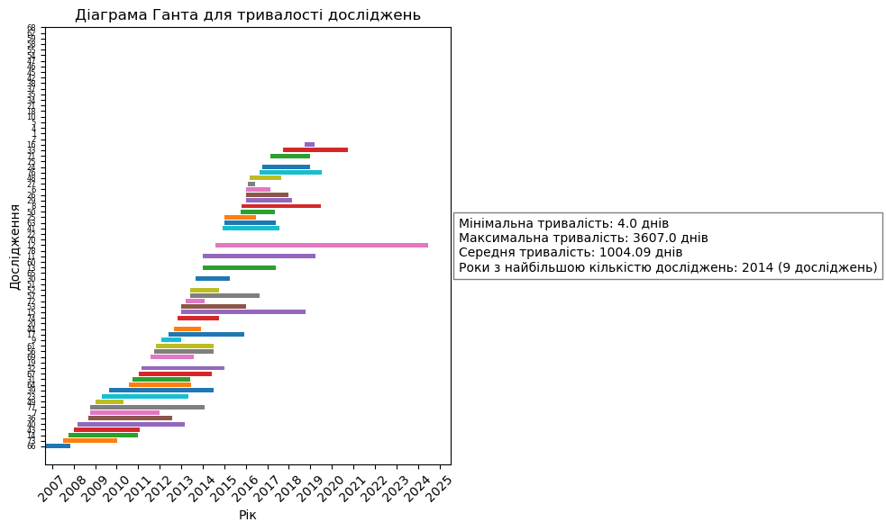
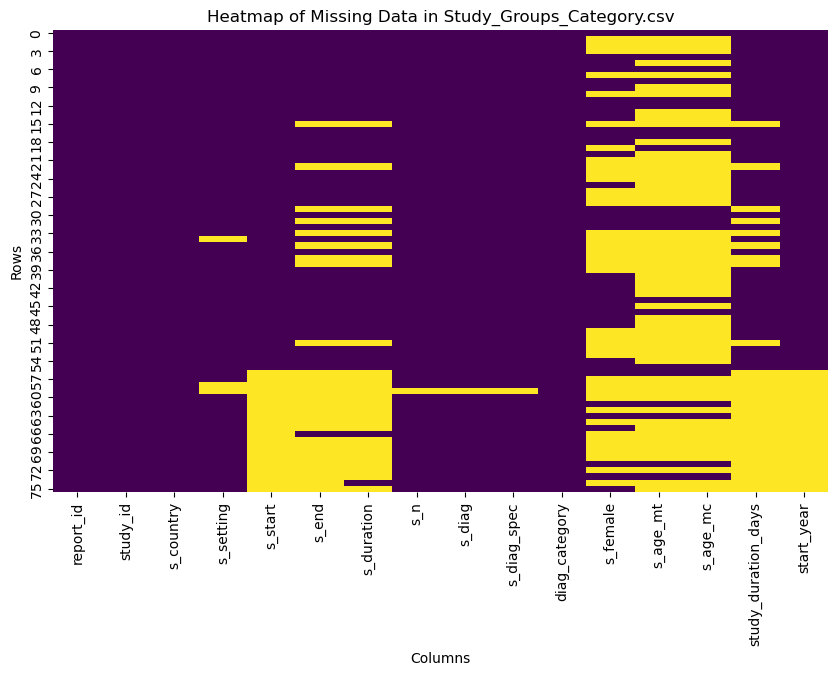

# Stage 1: Study Groups Categories Analysis

## Overview
This stage of the project focuses on preparing and analyzing data related to study groups and their characteristics. The goal is to clean, standardize, and visualize the data to uncover key insights that form a foundation for deeper analysis in subsequent stages.

## Key Objectives
1. **Ensure Data Quality**:
   - Identify and handle missing or inconsistent values.
   - Standardize key columns like `s_country` and `diag_category`.

2. **Visualize Data**:
   - Generate a Gantt chart to visualize study timelines.
   - Create a heatmap to assess data completeness.

3. **Extract Insights**:
   - Identify the largest study group.
   - Determine the study with the longest duration.
   - Highlight the most common diagnostic category.

## Process
1. **Data Cleaning and Standardization**:
   - Removed extra spaces and standardized entries in columns like `s_country` and `diag_category`.
   - Checked for missing values and addressed data quality issues.

2. **Data Visualization**:
   - **Gantt Chart**: Visualized study timelines to show the duration and sequence of research activities.
   - **Key Insights Visualization**: A bar chart showcasing the largest group, longest study, and most common diagnosis.

3. **Key Insights**:
   - **Largest Group**: Study ID 68 with 485 participants.
   - **Longest Duration**: Study ID 12 lasting 3,812 days.
   - **Most Common Diagnosis**: Depressive disorder, found in 10 studies.

## Visualizations
### Gantt Chart for Study Timelines

### Heatmap of Data Completeness

## Next Steps
With data cleaned and initial insights uncovered, the next stage will focus on more advanced analysis.

## How to Run
1. Clone this repository.
2. Open the `Stage 1_Study_Groups_Categories_Analysis.ipynb` file in Jupyter Notebook.
3. Ensure all required libraries are installed (`pandas`, `matplotlib`, `seaborn`).
4. Run the notebook to replicate the analysis and generate visualizations.

## Requirements
- Python 3.x
- Jupyter Notebook
- Libraries: `pandas`, `numpy`, `matplotlib`, `seaborn`

## Author
This project is part of an ongoing exploration in data analytics and storytelling. Stay tuned for further updates!

## List of Python Functions Used in the Analysis

Here is a list of the main Python functions applied for analysis and Gantt chart creation:

- pd.read_csv() – loads data from a CSV file into a DataFrame.

- pd.to_datetime() – converts data to date format, enabling accurate date-based calculations.

- DataFrame.sort_values() – sorts data by a specified column (in this case, S-START), which arranges studies in chronological order on the Gantt chart.

- DataFrame['column'].dt.days – calculates study duration in days by subtracting S-START from S-END and outputs the result as a number of days.

- DataFrame['column'].dt.year – extracts the year from the date, allowing for data grouping by year for further frequency analysis.

- value_counts() – counts occurrences of studies in each year to determine periods of peak activity.

- max() and min() – calculates the maximum and minimum study durations.

- mean() – calculates the average study duration, giving a general idea of the typical study period.

- matplotlib.pyplot.subplots() – creates a figure and axes for plotting the Gantt chart.

- ax.barh() – creates horizontal bars on the Gantt chart, where each bar represents an individual study.

- ax.set_yticks() and ax.set_yticklabels() – sets Y-axis labels to display study group numbers (study_ID) instead of indexes.

- mdates.YearLocator() and mdates.DateFormatter() from matplotlib.dates – formats the X-axis to show only years, providing a more readable time series.

- plt.text() – adds text information (legend) on the chart, including minimum, maximum, and average study durations as well as the years with the most studies.

- plt.xticks(rotation=45) – rotates the X-axis labels for better readability.

- plt.tight_layout() – optimizes the layout to ensure elements are properly spaced on the chart.

These functions facilitated a complete analysis workflow and the creation of a visualization that provides a clear view of the timing and duration of studies over time.
